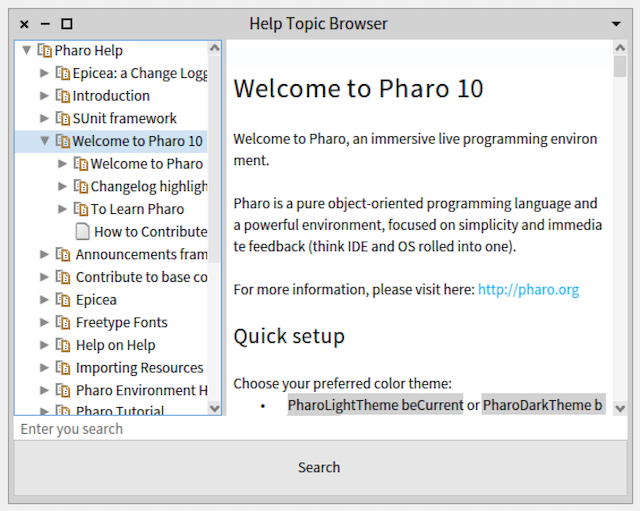

# Help system 
The help system is responsible for building and browsing help topics. 

## Help topics
A help topic consists of three parts:

- a title 
- the contents of this topic (the text)
- a set of sub-topics (which are topics also)

### Root topic
The help browser will at the moment only be able to present a single topic. While that sound somewhat restricted, the workaround is that several help topics become sub-topics of a single root-topic which has no contents of its own.

## Help browser
The help browser will display the topic hiearachy in a simple window like this:
.
In the left pane the topic hiearachy is shown, and in the left side the contents of the selected topic is shown. The browser can be resized and the middle bar moved to give a larger reading area.

## Topic building
The help system currently support three ways to obtain a root topic:

- From a folder on the local filesystem. This is useful if you are writing help and want to check that the help browser displays it like you want to.
- From a project on github. This is useful for documentation which should be available, but not downloaded. Its primary usecase is the pharo system documentation.
- Generated through the API (see further down). This is for _other situations_.

### Using the file and github builders
The topic hiearachy of the file and github builders both work on the same principles:

- The are given a _root_ from which to look for topics. It is a file or github folder.
- The builder will then build topics be (recursively) reading the contens of the root folder. Each file (with extension md or mic) and folder become a topic
- Each file is parsed and headers (down to a certain level) are _extracted_ and become topics.
- In principle only the leafs has contents. However, the contens of the leafs are _lifted_ into an aggregated contens of the parent topics.

The lifting is seen in the browser when you select a topic like "Welcome to...", which actually correspond to a folder, but the contents of its files are shown.
